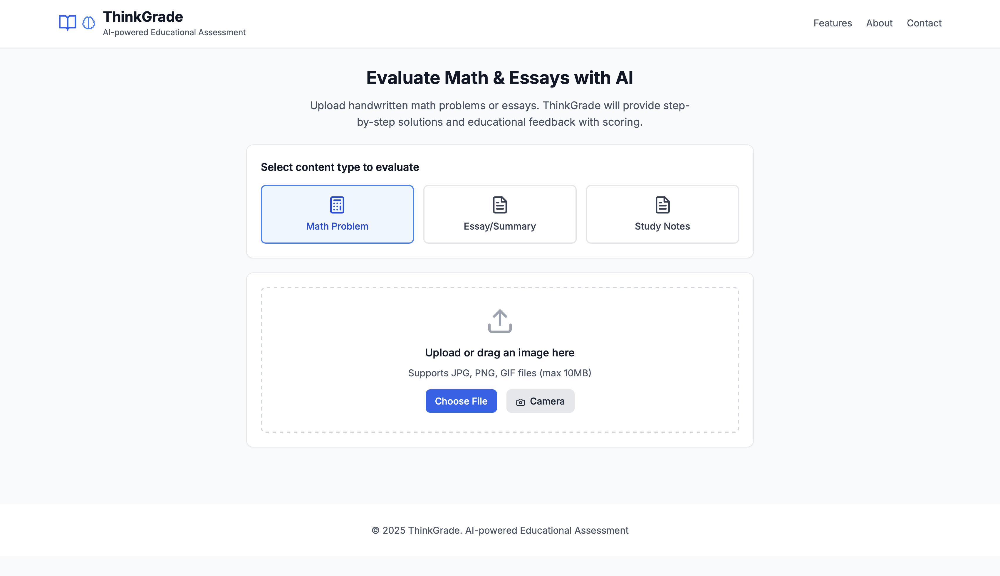
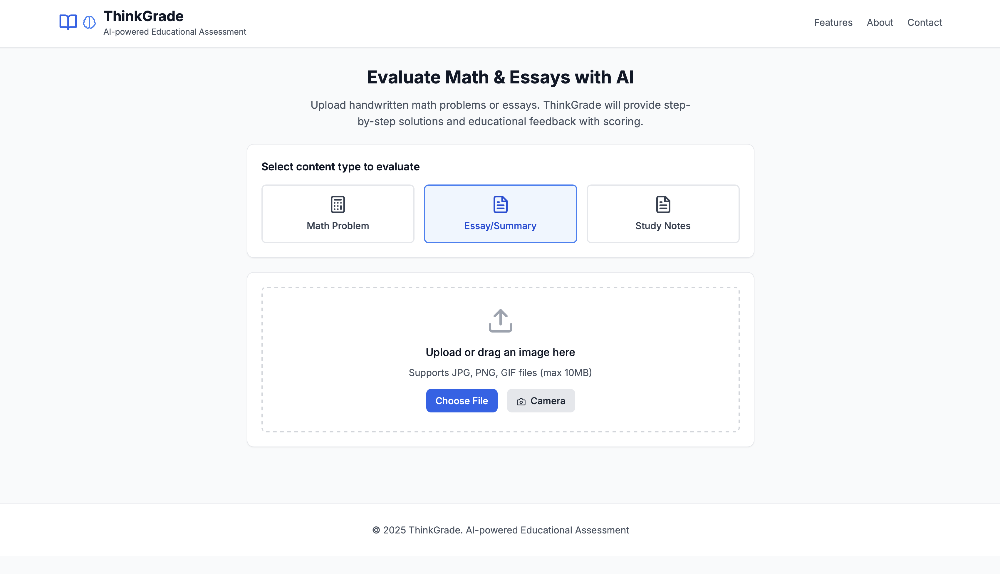

# ThinkGrade

An approachable AI companion that explains math and grades essays—straight from your laptop, tablet, or even a low-cost cloud GPU.

## 🖼️ Product Demo





## 🎯 Why ThinkGrade?

Most learning apps do one thing well: they either show you how to solve a math problem or tell you whether your writing is any good.

**ThinkGrade does both.** We fine-tuned Google's open-weight Gemma-3 n-E2B-it model so it can:
- **Walk through math step by step**—with LaTeX and clear reasoning
- **Score short essays or summaries** on a 0–5 scale—and explain why a score was assigned

Because everything runs in 4-bit quantization, ThinkGrade fits comfortably on two modest T4 GPUs (or a single A100). That means schools—or parents—can host it privately without handing student data to a third-party API.

## 🔧 How It Works

1. **You ask a question.**
   - "Solve ∫x² dx." or "Summarize this article in three sentences."

2. **ThinkGrade builds a tidy prompt.**
   - It prepends a "system" persona that keeps the model polite, safe, and organized, then adds your query.

3. **Gemma answers.**
   - Behind the scenes, the model carries two LoRA "hats":
     - **Math-Tutor LoRA**: generates step-by-step solutions
     - **Essay-Judge LoRA**: scores writing on logic, conciseness, and relevance

4. **You get a friendly response.**
   - **Math replies** come in three parts: Approach → Calculation → Final Answer (all LaTeX-ready)
   - **Essay replies** return a score (0–5) plus two or three sentences of feedback

## 📊 Data We Fed the Model

| Domain | Source & Size | What We Did |
|--------|---------------|-------------|
| **Math tutoring** | 30k–100k problems from MathX-5M | Stripped noisy `<think>` tags, kept final answers, wrapped each example in a chat template |
| **Essay tutoring** | 20k CNN/DailyMail articles + highlights | Turned each article into a "write a summary" prompt; target = reference summary |
| **Math grading** | 10k MathX-5M problems | Used GPT to write student-like answers, auto-labeled ✔/✘ via cosine similarity; balanced to 5k |
| **Essay grading** | 2k news articles | GPT-generated summaries; Sentence-BERT mapped similarity to scores 0–5 |

Everything streams straight from Hugging Face, so we never blow past Kaggle's RAM limit.

## 🚀 Training in a Nutshell

| Part | Trick | Why It Matters |
|------|-------|----------------|
| **4-bit NF4 quantization** | Shrinks memory ×4 with minimal quality loss | Efficient deployment |
| **LoRA + QLoRA** | Only 0.2% of weights are trainable | Perfect for hackathon budgets |
| **Rank & α** | r=4, α=8 (tutoring); r=8, α=16 (grading) | Lower rank = lower VRAM; higher rank when we need classifier muscle |
| **Grad accum 32** | True batch 64 on two T4s | Stable training |
| **bf16 + gradient-checkpointing** | Faster math, fewer out-of-memory errors | Optimized performance |

**End-to-end:**
- Math tutor SFT: ~3h on two T4s
- Math classifier: 45min on an A100
- Essay classifier: 25min on an A100

## 📈 Does It Actually Work?

| Task | Metric | Result |
|------|--------|--------|
| **Solve-and-Explain** | Human spot-check | Solutions are correct 9/10 times; LaTeX renders cleanly |
| **Math grading** | Accuracy | 92% on a held-out 1k set |
| **Essay grading** | Macro F1 | 0.78 across six score bands |

## 🎓 What We Learned

1. **Small can be mighty.** A 2-billion-parameter model—when pruned, quantized, and LoRA-patched—is plenty for K-12 tutoring.

2. **Prompt rigidity beats prompt magic.** By manually concatenating the prompt (no fancy `.apply_chat_template()`), we kept the model from drifting into off-topic tangents.

3. **Synthetic labels get you 80% there.** Auto-graded datasets let us stand up viable classifiers in days, not weeks.

## 🛠️ Technology Stack

### Core Components
- **Base Model**: Google Gemma-3 n-E2B-it
- **Fine-tuning**: QLoRA with 4-bit NF4 quantization
- **LoRA Adapters**: Math-Tutor (r=4, α=8) and Essay-Judge (r=8, α=16)
- **Deployment**: GGUF format for llama.cpp compatibility

### Frontend
- **React** + **TypeScript** + **Tailwind CSS**
- Real-time image upload and analysis
- LaTeX rendering for mathematical expressions

### Backend
- **FastAPI** (Python) - High-performance API server
- **TrOCR** (HuggingFace) - Handwriting recognition
- **llama.cpp** - Efficient local inference

## 🚀 Quick Start

### Prerequisites
- Python 3.8+
- Node.js 16+
- GPU with 8GB+ VRAM (for fine-tuning)
- 2x T4 GPUs or 1x A100 (recommended)

### 1. Clone the Repository
```bash
git clone https://github.com/LeannaJ/gemma_3n_educational_evaluator.git
cd gemma_3n_educational_evaluator
```

### 2. Backend Setup
```bash
cd backend
python -m venv venv
source venv/bin/activate  # Windows: venv\Scripts\activate
pip install -r requirements.txt
uvicorn main:app --reload
```

### 3. Frontend Setup
```bash
cd frontend
npm install
npm start
```

### 4. Access the Application
- Frontend: http://localhost:3000
- Backend API: http://localhost:8000

## 📁 Project Structure

```
AI_Product_Gemma/
├── frontend/                 # React web application
│   ├── src/
│   │   ├── components/      # React components
│   │   ├── App.tsx         # Main application
│   │   └── types.ts        # TypeScript definitions
│   └── package.json
├── backend/                 # FastAPI server
│   ├── main.py             # API endpoints
│   ├── ocr_service.py      # Handwriting recognition
│   ├── llm_service.py      # AI evaluation service
│   └── requirements.txt
├── colab/                  # Google Colab notebooks
│   ├── Gemma_FT_Math_*.ipynb    # Math fine-tuning
│   ├── Gemma_FT_Reading_*.ipynb # Reading fine-tuning
│   └── GGUF_Transformation.ipynb # Model conversion
├── dataset/                # Training datasets
│   ├── essay_eval_multiclass_2000/
│   └── math_eval_binary_dataset/
├── finetune_*.py           # Fine-tuning scripts
└── run_*.sh               # Execution scripts
```

## 🔧 Fine-tuning Pipeline

### 1. Data Preparation
- **MathX-5M**: 30k-100k problems for math tutoring
- **CNN/DailyMail**: 20k articles for essay evaluation
- **Synthetic Data**: GPT-generated student responses for grading

### 2. QLoRA Fine-tuning
```bash
# Run fine-tuning on Google Colab
# Upload finetune_gemma_cnn_dailymail.ipynb to Colab
# Set GPU runtime and execute all cells
```

### 3. Model Conversion
```bash
# Convert to GGUF format for local deployment
python -m llama_cpp.convert_hf_to_gguf \
    --outfile models/thinkgrade.gguf \
    --outtype q4_k_m \
    --model-dir ./fine-tuned-model
```

## 🧪 Usage Examples

### Math Problem Solving
```python
# Example API call
curl -X POST "http://localhost:8000/analyze-handwriting" \
     -H "Content-Type: multipart/form-data" \
     -F "file=@math_problem.jpg" \
     -F "subject=math"
```

### Essay Evaluation
```python
# Example API call
curl -X POST "http://localhost:8000/analyze-handwriting" \
     -H "Content-Type: multipart/form-data" \
     -F "file=@essay.jpg" \
     -F "subject=essay"
```

## 🗺️ Roadmap

### Phase 1: Enhanced Input
- **Hand-written math input** – pair Gemma with a lightweight OCR so students can snap a photo of their scratch work

### Phase 2: Improved Evaluation
- **Rubric-based essays** – break the 0–5 score into sub-scores (logic, grammar, style)

### Phase 3: Advanced Training
- **Pairwise ranking & RLHF** – teach the model which feedback is most helpful

### Phase 4: Edge Deployment
- **One-click offline bundle** – export to GGUF for llama.cpp; aim for < 1 GB so a Raspberry Pi can host ThinkGrade at the edge

## 🚨 Important Notes

### Hardware Requirements
- **Fine-tuning**: 2x T4 GPUs or 1x A100 (16GB+ VRAM)
- **Inference**: CPU with 8GB+ RAM or GPU with 4GB+ VRAM
- **Edge Deployment**: Raspberry Pi compatible (< 1GB model size)

### Model Limitations
- Handwriting quality affects OCR accuracy
- Complex mathematical notation may require preprocessing
- Essay evaluation is based on educational standards (0-5 scale)

## 🤝 Contributing

1. Fork the repository
2. Create a feature branch (`git checkout -b feature/amazing-feature`)
3. Commit your changes (`git commit -m 'Add amazing feature'`)
4. Push to the branch (`git push origin feature/amazing-feature`)
5. Open a Pull Request

## 📄 License

This project is licensed under the MIT License - see the [LICENSE](LICENSE) file for details.

## 📚 References

- [Gemma Model Documentation](https://huggingface.co/google/gemma-3n-2b-it)
- [QLoRA Paper](https://arxiv.org/abs/2106.09685)
- [MathX-5M Dataset](https://huggingface.co/datasets/microsoft/MathX-5M)
- [CNN/DailyMail Dataset](https://huggingface.co/datasets/cnn_dailymail)
- [llama.cpp Documentation](https://github.com/ggerganov/llama.cpp)
